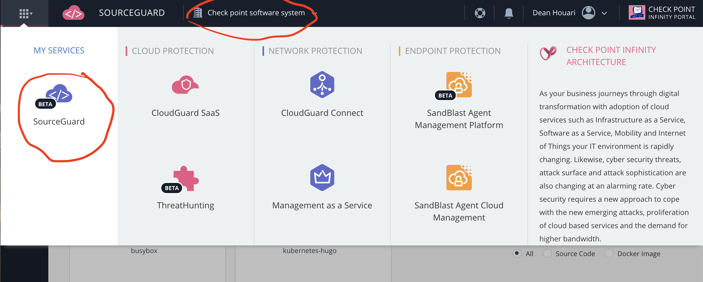
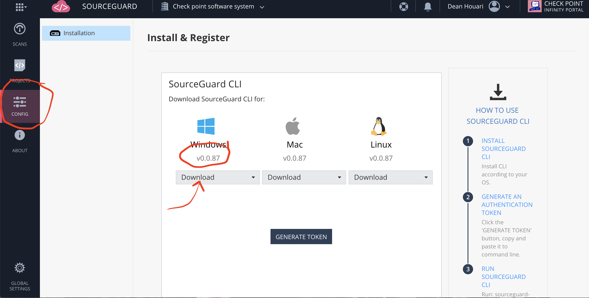
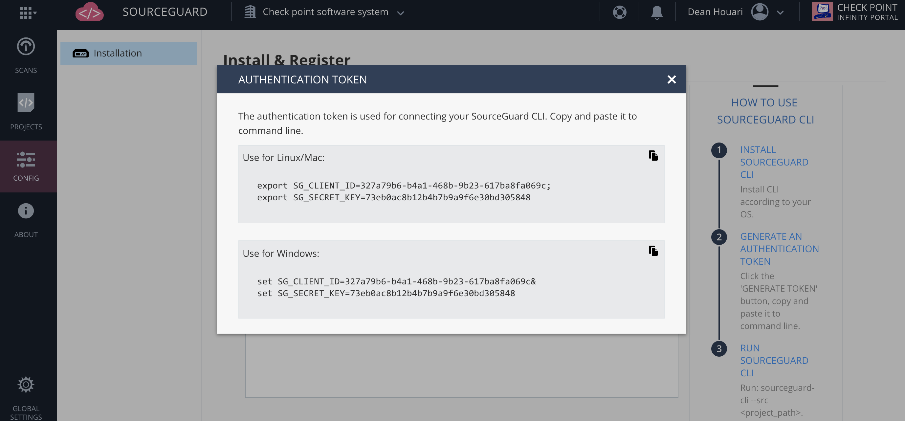

# CheckPoint SOURCEGUARD
CheckPoint Software source code and container image scanner

With the rapid adoption of devops for application build and runtime, workloads have evolved from infrastructure servers and virtual machines to code with containers and serverless.
Infrastructure style security has to evolve as well to code centric security from application build to runtime by shifting to the left and by becoming treated as code.
DevOps is built around a CI/CD methodology with various stage where all the stages are automated and interconnected by pipeline from build to deployment.
For the application of security in an CI/CD pipeline, it is important to identify the stages of the CI/CD pipeline. 
This is well illustrated by the 4Cs of Cloud Native Security as defined by the CNCF. 
The 4Cs encompass code,container,kubernetes(COE) and Cloud(hybrid, multi, private,on-prem) and are depending on each other. Securing each element of the 4Cs is critical.
https://kubernetes.io/docs/concepts/security/overview/
           
   
   
The first stage when the application developpers is to upload sourcen code to a various branches to a versioned repository such GitHub or Git. In order to ensure that the code is secure and free of potential source of attacks such as credentials
and CVEs, it is important to perform source code scanning statically and dynamically identified as SAST and DAST. Effectively scanning when it is ready and commited to a branch and while it is being stored
in a branch on a repo.
When the code is ready to be compiled into an artifact such as a container, it is important to then scan the container image to tested and deployed.
We will be providing support for Docker and the way to create a container is with a Dockerfile which defines the containers images, source code and commands used by the app container image.
As developpers get these container images such as busybox, node, nginx etc.. from DockerHub, they may be including CVEs and critical malware.
The SourceGuard scanner will provide SAST and DAST for source code and container images. 
there are many SAST and DAST scanners such Clair and Anchore but the true se3curity value is with the ability to find CVEs and Critical Malware.
We at CheckPoint will be using ThreatCloud on the scanner backend. ThreadCloud is the market leading vulnerability and CVE DB that is been succesfully used
on our endpoint security.
ThreatCloud will bring the best CVE and Malware DBs engine with our SAST and DAST security. 
SourceGuard is in available for Beta testing on the CheckPoint Infinity portal.

## SOURCEGUARD Installation

Please go to portal.checkpoint.com 
Create an account by signing up to Infinity even if you are a checkpoint employee. The default space for checkpoint employee is cp-all-demo which CANNOT be used. please switch to your registered account space.

   
   
Please click on the SourceGuard service under the CONFIG tab on the left side menu and chose the Operating System of your choice ..Windows, MacOS or Linux by clicking on Dowload. the latest file is the recommeded choice and please download to your system in a dir.
I would recommend creating a directory to store the file and where you can run all your scans.

  
  
 As you can scan code and docker container images, you will need to install Docker on you OS or you could run docker on a linux VM using virtual box. Please refer to my mastering kubernetes lab page where i provide a vagrant script to deploy Vbox VMs in a devops manner.
 
 ## For MacOS:
 
Please download and copy the sourceguard-cli file to a directory of your choice then make the sourceguard-cli as executable with the 
<chmod 750> command using the mac terminal.
 
```
dean:Downloads dasig$ 
dean:Downloads dasig$ cp sourceguard-cli ~/sourceguard
dean:Downloads dasig$ cd sourceguard 
dean:sourceguard dasig$ ls
sourceguard-cli
dean:sourceguard dasig$ chmod 750 sourceguard-cli   
dean:sourceguard dasig$ ./sourceguard-cli
05-04-2020 19:39:33.004 SourceGuard Started
please specify source code path or docker image tar path
dean:sourceguard dasig$ ./sourceguard-cli -help
Usage of ./sourceguard-cli:
  -V	print version
  -d	debug output flag
  -img string
    	path to docker image tar format
  -j	json output flag
  -src string
    	path to source code directory
  -t int
    	timeout (default 600)
  -x value
    	exclusions: path to exclude from scanning .gitignore syntax
 
 ```
 
 The next step will be to create a token in order to associate the sourceguard-cli command utility to the infinity portal where it will display all scans performed and their results.
 
  
 
```
dean:sourceguard dasig$ export SG_CLIENT_ID=327a79b6-b4a1-468b-9b23-617ba8fa069c;
dean:sourceguard dasig$ export SG_SECRET_KEY=73eb0ac8b12b4b7b9a9f6e30bd305848
dean:sourceguard dasig$ 

```
## YOU ARE NOW READY TO SCAN SOURCE CODE AND CONTAINERS

### Run the sourceguard CLI as an executable with ./

> ./sourceguard-cli

Note: in order to scan Docker container images, you will need to save docker images in a .tar file

```
dean:sourceguard dasig$ docker images
REPOSITORY                        TAG                 IMAGE ID            CREATED             SIZE
testwebserver                     latest              23802c78f6a2        2 months ago        939MB
node                              latest              2a0d8959c8e1        2 months ago        939MB
h1kkan/jenkins-docker             lts                 155fb6109564        6 months ago        1.41GB
kubernetes-hugo                   latest              cb484dc1e163        8 months ago        213MB
alpine                            latest              4d90542f0623        9 months ago        5.58MB
f5devcentral/f5-demo-app          2.0.0               4a0258aa1752        10 months ago       58MB
arush/gateone                     http                0217951b392b        12 months ago       1.19GB
arush/cka_lab                     latest              28ee82e1b525        22 months ago       20.4MB
lucapalano/jenkins-newman         latest              7b076ab30c03        2 years ago         945MB
dean:sourceguard dasig$ 
dean:sourceguard dasig$ docker save f5devcentral/f5-demo-app  -o f5.tar
dean:sourceguard dasig$ 
dean:sourceguard dasig$ ls
f5.tar		sourceguard-cli
dean:sourceguard dasig$ ./sourceguard-cli -img f5.tar
05-04-2020 19:55:46.671 SourceGuard Started
05-04-2020 19:55:48.247 Project name: f5-demo-app path: /var/folders/b4/dpgj60zj7854dsd2kdhbdhp80000gn/T/sourceGuard294012542
05-04-2020 19:55:48.247 Scan id: 426ffbadad83a72be592b4ebdbc4b4ce2662660be298c58a8756fdc073b18196-uA9C6C
05-04-2020 19:55:54.409 Scanning ...

```


 
   
   


