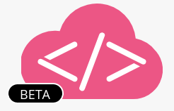
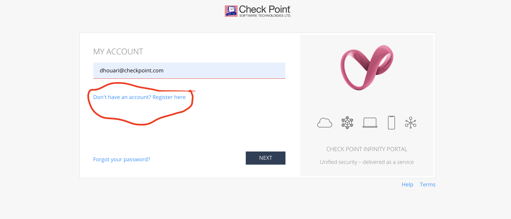
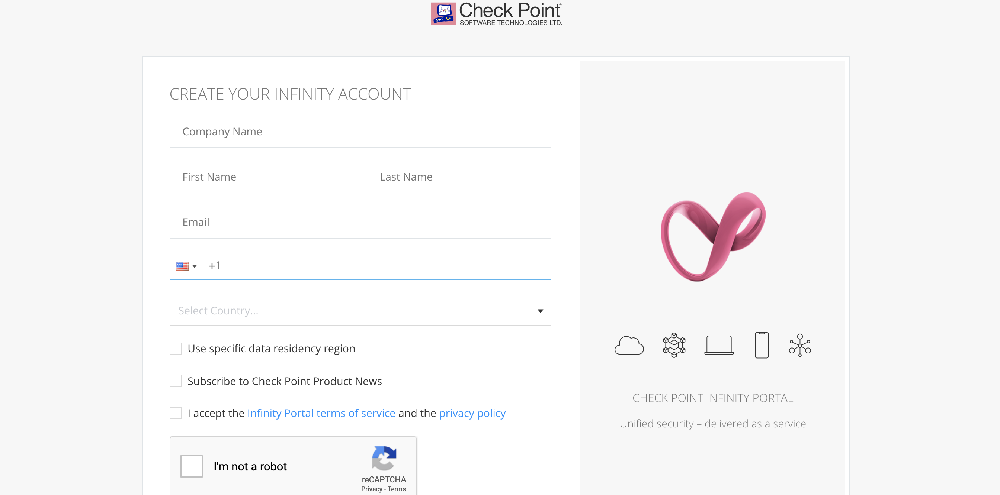
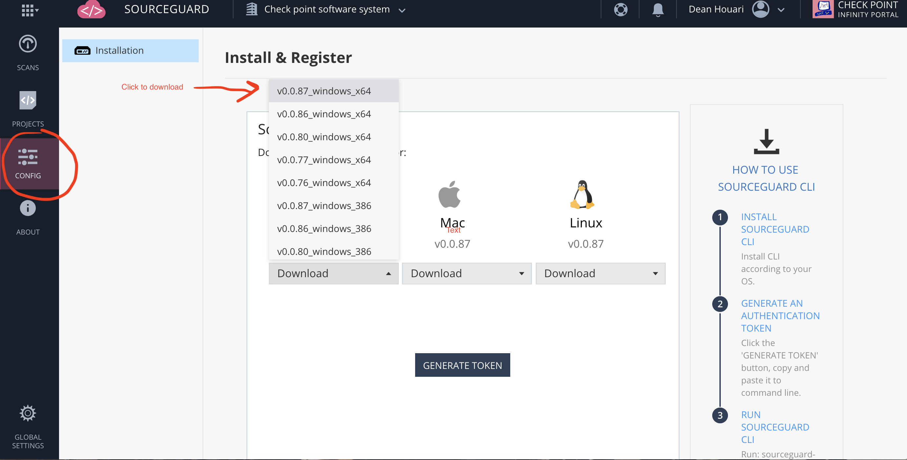
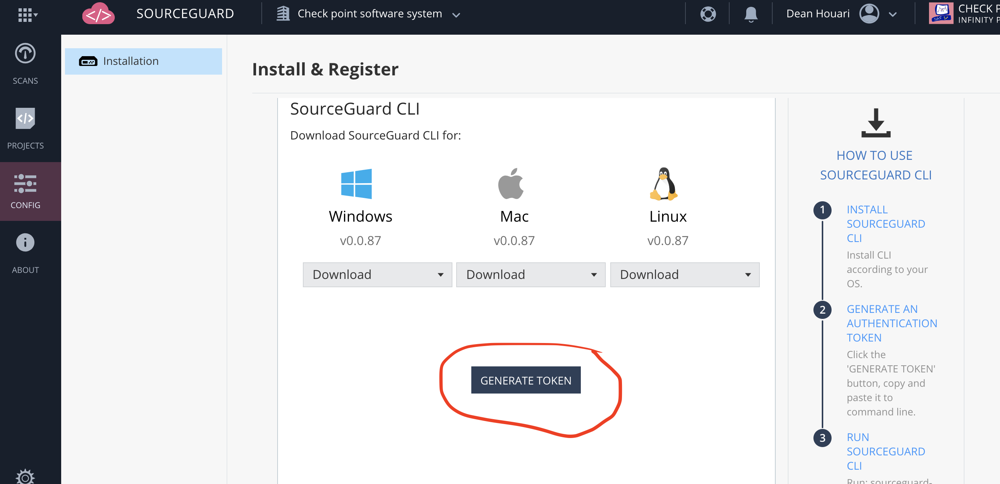
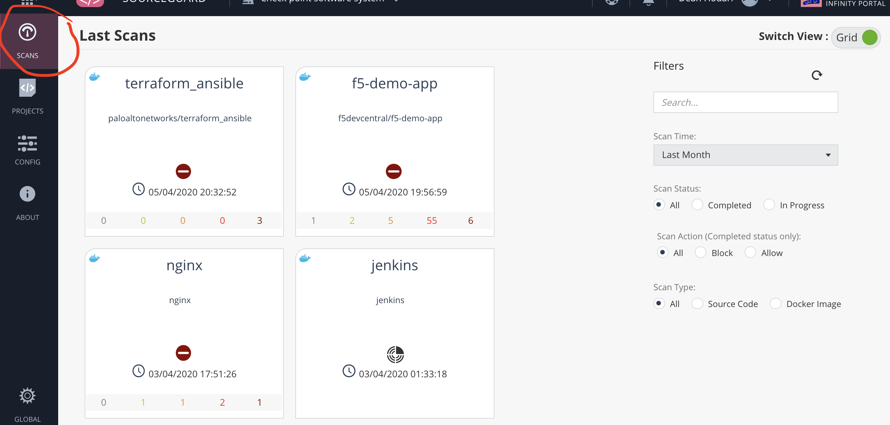
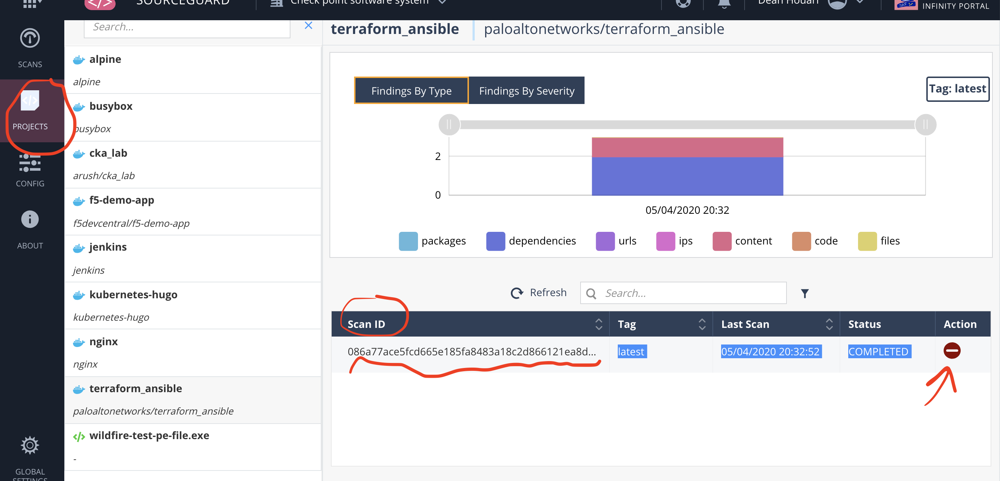

# CheckPoint SourceGuard 
## CheckPoint DevSecOps Source Code and Docker Container Image Scanner.

With the rapid adoption of devops for application build and runtime, workloads have evolved from infrastructure servers and virtual machines to code with containers and serverless.
Infrastructure style security has to evolve as well to code centric security from application build to runtime by shifting to the left and by becoming treated as code.
DevOps is built around a CI/CD methodology with various stage where all the stages are automated and interconnected by pipeline from build to deployment.
It is important to natively integrate security to the main stages of the CI/CD pipeline from BUILD to RUNTIME in order to allow application teams to develop apps securely at devops and cloud native speed.

This is well illustrated by the 4Cs of Cloud Native Security as defined by the CNCF. 
The 4Cs encompass code,container,kubernetes(COE) and Cloud(hybrid, multi, private,on-prem) and are depending on each other. Securing each element of the 4Cs is critical.
https://kubernetes.io/docs/concepts/security/overview/
           
   
   
The first stage when the application developpers is to upload sourcen code to a various branches to a versioned repository such GitHub or Git. In order to ensure that the code is secure and free of potential source of attacks such as credentials
and CVEs, it is important to perform source code scanning statically and dynamically identified as SAST and DAST. Effectively scanning when it is ready and commited to a branch and while it is being stored
in a branch on a repo.
When the code is ready to be compiled into an artifact such as a container, it is important to then scan the container image to tested and deployed.
We will be providing support for Docker and the way to create a container is with a Dockerfile which defines the layers composed of containers images, source code and commands used by the app container image.
As developpers use these container images such as busybox, node, nginx etc.. from DockerHub, they may be including CVEs and critical malware.
You can find Container training on my page on how to use Docker containers and create a Docker container image: 
> https://github.com/chkp-dhouari/Mastering-Kubernetes/blob/master/Just-Enough-Containers.md

The SourceGuard scanner will provide SAST and DAST for source code and container images. 
there are many SAST and DAST scanners such Clair and Anchore but the true se3curity value is with the ability to find CVEs and Critical Malware.
SourceGuard will be using ThreatCloud on backend using the MD5/SHA256 signatures of the content scanned. 
ThreadCloud is the market leading vulnerability and CVE DB that is been succesfully used
on our endpoint security.
ThreatCloud will bring the best CVE and Malware DBs engine with our SAST and DAST security.  
> https://community.checkpoint.com/t5/CheckMates-Nuggets/What-is-Threat-Cloud/td-p/47738
  
## SourceGuard is NOW available for Beta testing on the CheckPoint Infinity portal.
### Note: While in Beta testing, we will allow up to 100Mb of scans per day.

## SourceGuard Installation:

Please go to the Infinity portal at https://portal.checkpoint.com
Create an account by signing up to Infinity even if you are a checkpoint employee.

   
   
   

The default user space for checkpoint employee is cp-all-demo which CANNOT be used. please switch to your registered account space under the building icon in the top menu bar.

   
   
Please click on the SourceGuard service under the CONFIG tab on the left side menu and chose the Operating System of your choice ..Windows, MacOS or Linux and then on Download. The latest file is the recommeded choice and please download it to your system in a dir of your choice.
I would recommend creating a directory to store the file and where you can run all your scans.

  
 
### For source code scanning

> sourceguard-cli -src file 
           
### For Docker image scanning:
#### Note:  Installing Docker is not required for using SourceGuard on your system . ALL you need is a docker image in a .tar file format.

> sourceguard-cli -img <docker_image>.tar

#### In order to convert a Docker image in .tar file, please do:

> docker save docker_image -o any_file_name.tar
 
 
 ## MacOS Installation:
 
Please download and copy the sourceguard-cli file to a directory of your choice 

### Make the sourceguard-cli as executable 

> chmod 750 sourceguard-cli
 
```
dean:Downloads dasig$ 
dean:Downloads dasig$ cp sourceguard-cli ~/sourceguard
dean:Downloads dasig$ cd sourceguard 
dean:sourceguard dasig$ ls
sourceguard-cli
dean:sourceguard dasig$ chmod 750 sourceguard-cli   
dean:sourceguard dasig$ ./sourceguard-cli
05-04-2020 19:39:33.004 SourceGuard Started
please specify source code path or docker image tar path
dean:sourceguard dasig$ ./sourceguard-cli -help
Usage of ./sourceguard-cli:
  -V	print version
  -d	debug output flag
  -img string
    	path to docker image tar format
  -j	json output flag
  -src string
    	path to source code directory
  -t int
    	timeout (default 600)
  -x value
    	exclusions: path to exclude from scanning .gitignore syntax
 
 ```
 
 The next step will be to create a token in order to associate the sourceguard-cli command utility to the infinity portal where it will display all scans performed and their results.
 
  
  
 Then paste the generated token at the command line:
 
```
dean:sourceguard dasig$ export SG_CLIENT_ID=..hiden output..
dean:sourceguard dasig$ export SG_SECRET_KEY=..hiden output..
dean:sourceguard dasig$ 

```
Please keep these token values safe..
## YOU ARE NOW READY TO SCAN YOUR SOURCE CODE AND YOUR DOCKER CONTAINER IMAGES!

### Run the SourceGuard CLI with ./ on MacOS:

> ./sourceguard-cli

Note: in order to scan Docker container images, you will need to save docker images in a .tar file.
In the example below, i am scanning the PALO ALTO container image for Terraform/Ansible that i downloaded from Docker hub..

```
dean:sourceguard dasig$ docker images
REPOSITORY                           TAG                 IMAGE ID            CREATED             SIZE
owasp/railsgoat                      latest              69f009ec9735        2 weeks ago         1.25GB
testwebserver                        latest              23802c78f6a2        2 months ago        939MB
node                                 latest              2a0d8959c8e1        2 months ago        939MB
h1kkan/jenkins-docker                lts                 155fb6109564        6 months ago        1.41GB
kubernetes-hugo                      latest              cb484dc1e163        8 months ago        213MB
alpine                               latest              4d90542f0623        9 months ago        5.58MB
f5devcentral/f5-demo-app             2.0.0               4a0258aa1752        10 months ago       58MB
arush/gateone                        http                0217951b392b        12 months ago       1.19GB
paloaltonetworks/terraform_ansible   latest              ee1b39b7d2f2        13 months ago       499MB
arush/cka_lab                        latest              28ee82e1b525        22 months ago       20.4MB
lucapalano/jenkins-newman            latest              7b076ab30c03        2 years ago         945MB
vulnerables/web-owasp-railsgoat      latest              7e920996d870        2 years ago         719MB
dean:sourceguard dasig$ 
dean:sourceguard dasig$ docker save paloaltonetworks/terraform_ansible -o palo.tar
dean:sourceguard dasig$ 
dean:sourceguard dasig$ ls -l palo.tar
-rw-------  1 dasig  staff  511048704 Apr  5 20:25 palo.tar
dean:sourceguard dasig$ 
dean:sourceguard dasig$ 
dean:sourceguard dasig$ ./sourceguard-cli -img palo.tar
05-04-2020 20:30:55.813 SourceGuard Started
05-04-2020 20:30:57.357 Project name: terraform_ansible path: /var/folders/b4/dpgj60zj7854dsd2kdhbdhp80000gn/T/sourceGuard162328374
05-04-2020 20:30:57.357 Scan id: 086a77ace5fcd665e185fa8483a18c2d866121ea8d7535bdaa99989d23c09427-cTfA8E
05-04-2020 20:31:06.750 Scanning ...
05-04-2020 20:32:49.848 Analyzing ...
05-04-2020 20:33:51.766 Action: BLOCK
Content Findings:
	- ID: .....
	  Name: "aws_secret_access_key"
	  Description: "Possible AWS secret access key"
		
	......	
```

The results are displayed on the portal and CLI and was flagged as BLOCK...The SourceGuard scan found many critical CVEs 
This illustrate the importance of container image scanning from any source on Docker Hub  and the ability of SOURCEGUARD to succesfully find critical issues with ThreatCloud 

 


 ## LINUX Installation:
 
 The installation on Linus is pretty much the same as MacOS by downloading the sourceguard-cli file on your linux system or VM.
 You can build Linux VMs using virtual box automatically in a devops manner with the Vagrant I provided with my mastering Kubernetes course. The Vagrant script will also install Docker and installation steps are located at: 
> https://github.com/chkp-dhouari/Mastering-Kubernetes/blob/master/Provision-the-Kubernetes-environment.md

 ### Make the sourceguard-cli file as executable with chmod +x command:
 
 > chmod +x sourceguard-cli
 
 ### Then run the sourceguard-cli:
 
 > sourceguard-cli -src or -img
 
 or
 
 > ./sourceguard-cli -src or -img
 
 
## WINDOWS Installation:

Download the sourceguard-cli exe file to the sourceguard directory that you created, copy the tokens and then execute the sourceguard-cli from the windowns command line tool.
 
 
# SourceGuard Management and Tracking:
    All the scans performed can be accessed under the Scans tab and are all catalogued under the Project tab. 
    Each scan can be identified with a scan id which is automatically generated when running the scan at the command line.


   
   
   
   


